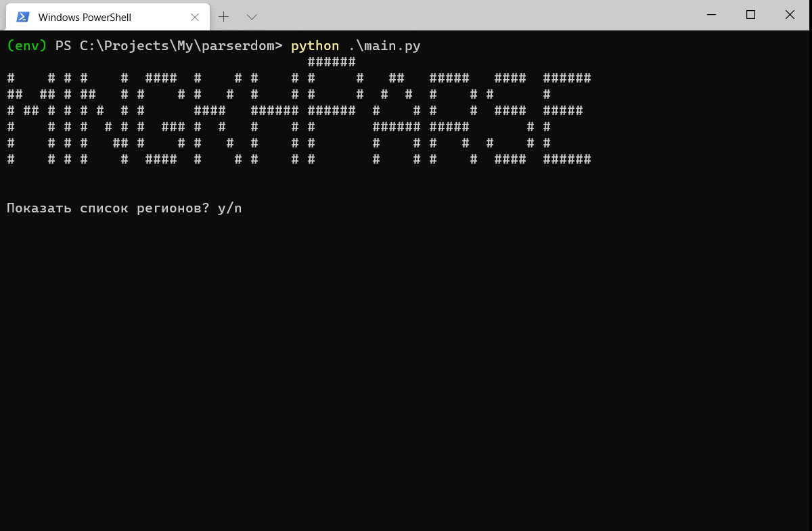

# mingkhParser

Парсер сайта дом.минжкх\
Экспорт данных по домам населённых пунктов России в файл.

Доступные форматы для сохранения: CSV и EXCEL.

Запуск: файл main.py.
Выбор региона, населенного пункта и формата для сохранения.
  

  
## TODO:
  * рефакторинг,
  * добавить сохранение данных только по определенной улице,
  * реализовать интерфейс с помощью Tkinter,
  * реализовать БД.